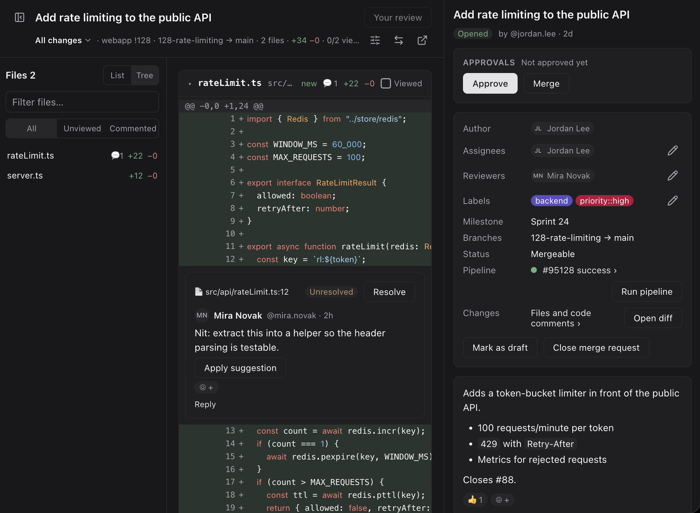
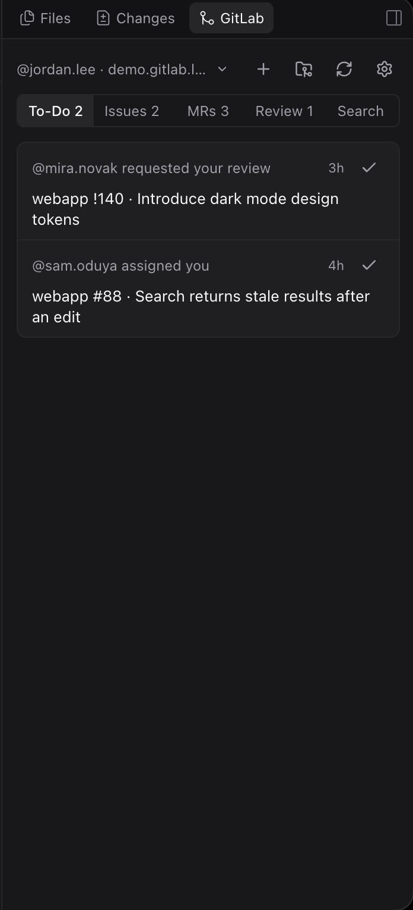
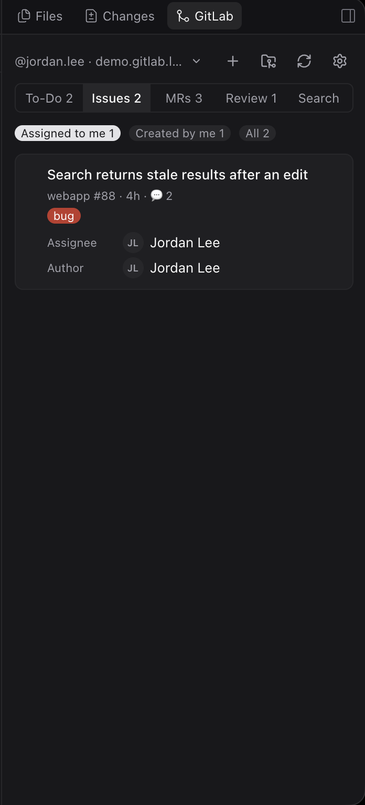
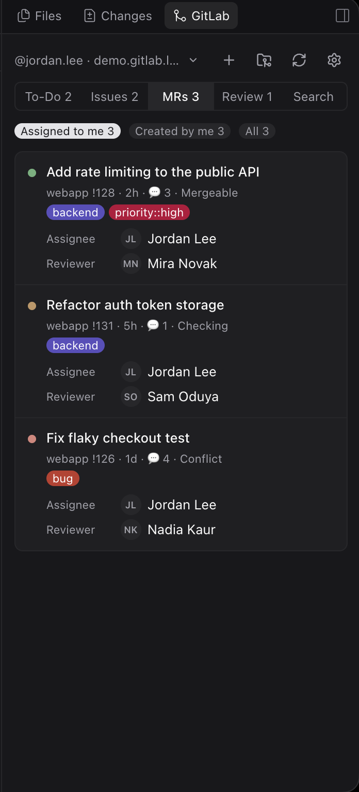
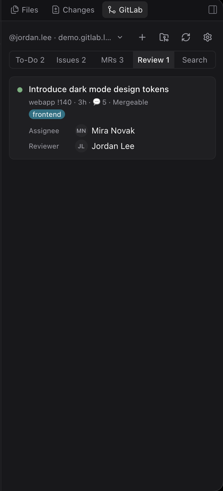
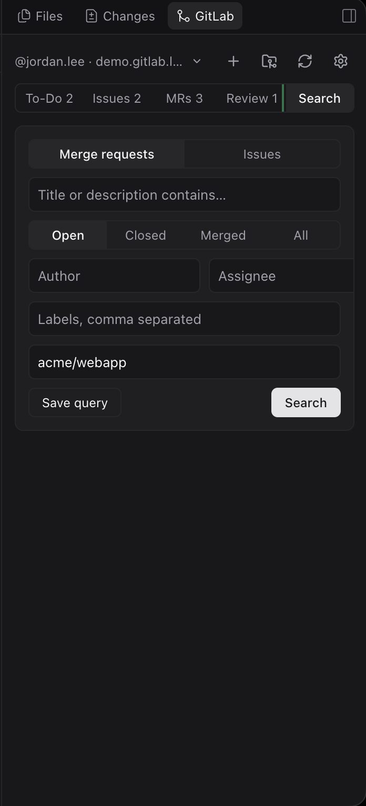
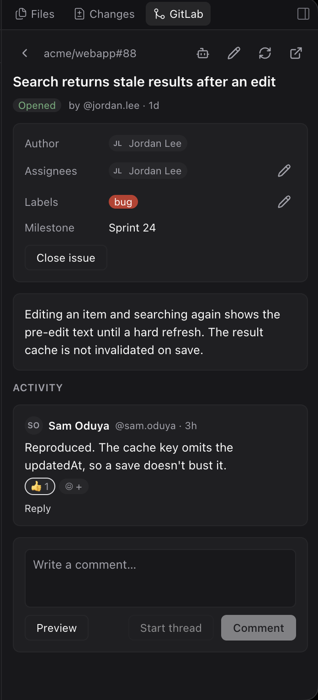
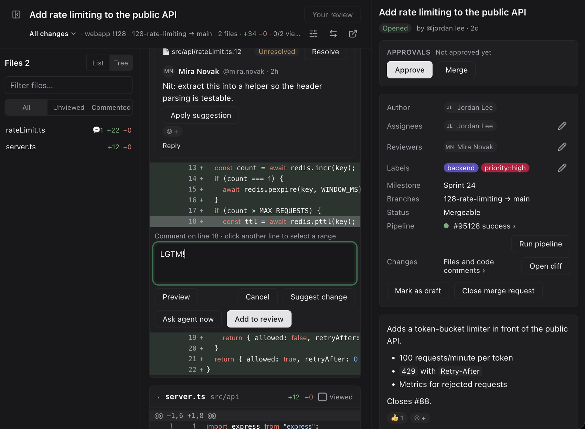
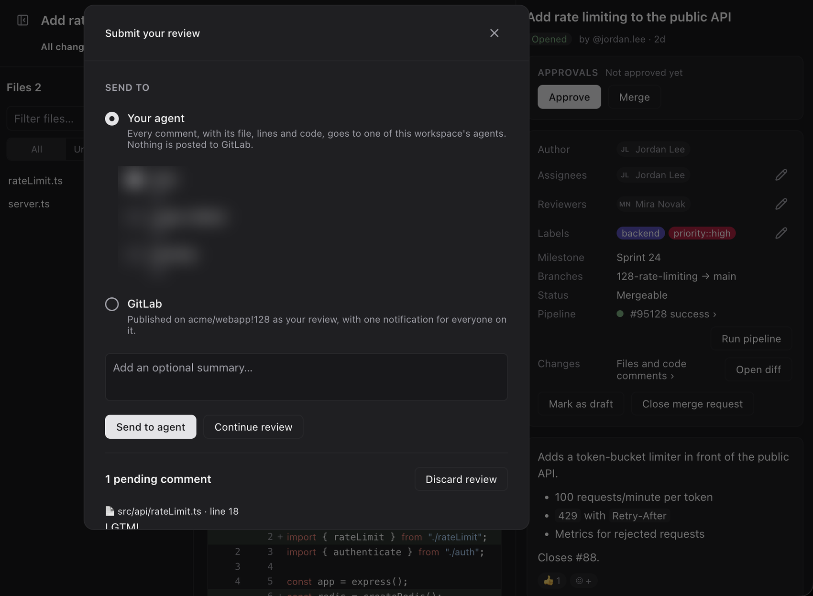

# GitLab for Paseo

[](LICENSE)
[](https://nodejs.org)
[](test)
[](https://prettier.io)

A mini GitLab that lives inside [Paseo](https://getpaseo.com). Your to-dos, issues,
merge requests and review requests in the explorer sidebar; a full merge-request
review — diff, threads, approvals, pipelines — in the main area; and one button to
hand any of it to one of your agents. It talks to GitLab's API directly with a
personal access token kept in the OS keychain, so it needs neither the `glab` CLI
nor a browser tab.



---

## Contents

- [Install](#install)
- [Connect a GitLab](#connect-a-gitlab)
- [Try it without an account: demo mode](#try-it-without-an-account-demo-mode)
- [The panel](#the-panel) — To-Do, Issues, MRs, Review, Search
- [Issue and merge-request detail](#issue-and-merge-request-detail)
- [Reviewing a merge request](#reviewing-a-merge-request) — diff, threads, review stack
- [Merge, approvals, rebase and conflicts](#merge-approvals-rebase-and-conflicts)
- [Pipelines and jobs](#pipelines-and-jobs)
- [Repository browser](#repository-browser)
- [Working with agents](#working-with-agents)
- [Several GitLab accounts](#several-gitlab-accounts)
- [Security](#security)
- [How it is built](#how-it-is-built)
- [Development](#development)

---

## Install

The plugin is a directory, not a published package. Point Paseo at a checkout:

```bash
git clone <this repo> paseo-gitlab
cd paseo-gitlab
npm install            # dev-time types only; nothing ships to the client
paseo plugin add ./paseo-gitlab
```

`paseo plugin reload gitlab` picks up local changes without restarting Paseo.

Requires Paseo `>= 0.9.0` (see `paseo-plugin.json`).

## Connect a GitLab

Open **Settings → GitLab** and paste a personal access token with the `api` scope.
The token is checked against GitLab before anything is stored; a typo, an expired
token or one without `api` is reported on the spot. Once it is accepted the token
goes into the OS keychain and never reaches the plugin's client side again.

The connect form links straight to GitLab's token page with the name and scope
pre-filled, so creating the right token is one click.

## Try it without an account: demo mode

To see every screen on invented data, connect to the host `https://demo.gitlab.local`
with any text as the token. The plugin recognises that host and answers every
request from a built-in fixture — no network, no token, no real project touched.
All the people, projects and text in demo mode are fictional. This is how the
screenshots below were produced.

---

## The panel

The GitLab panel opens in the explorer sidebar (and can be moved to the main area).
Its header button, in every workspace, carries a badge counting what is waiting on
you — review requests, to-dos, and a mark when one of your MRs has a failed pipeline.

Five tabs, each with a count:

| Tab | Shows |
|-----|-------|
| **To-Do** | Your pending GitLab to-dos, each opening its issue or MR; mark done in place. |
| **Issues** | Issues you author or are assigned, with a role filter (Assigned / Created / All). |
| **MRs** | Your merge requests, same role filter, with pipeline status, reviewers and labels. |
| **Review** | Merge requests waiting for **your** review. |
| **Search** | A query builder over issues or MRs, with saved queries. |

Every row shows the reference, age, comment count, merge status, labels, and the
assignees, reviewers and author with their avatars.

| To-Do | Issues | Merge requests |
|-------|--------|----------------|
|  |  |  |

| Review requests | Search with saved queries |
|-----------------|---------------------------|
|  |  |

## Issue and merge-request detail

Open any row for the full item, rendered from GitLab's own HTML so references,
task lists, tables and code blocks look the way they do on the site.



From the detail view you can:

- **Edit** the title, description, assignees, reviewers and labels in place.
- **Close / reopen**, or toggle **draft** on an MR.
- **Read and reply** to every thread, **resolve** and unresolve, **edit or delete**
  your own notes, and **react** with emoji.
- Choose **Comment** (a plain note) or **Start thread** (a resolvable discussion)
  when you post.
- **Apply a suggestion** straight from a note.
- Compose with **mentions**, a **Preview**, and **paste-to-upload** for images.

## Reviewing a merge request

Open an MR's changes in the workspace's main area, next to its agents. A resizable,
collapsible file tree on the left; the diff on the right; the MR's own detail —
approvals, merge, pipeline, description — alongside.


The diff supports:

- **Syntax highlighting** and horizontal scrolling, with a **Wrap lines** toggle.
- **Side-by-side** or inline, and **hide whitespace-only changes**.
- **Expand context** — pull in the unchanged lines around a hunk from the file at
  the head commit.
- **Viewed** per file, remembered by a fingerprint of the diff so the mark lapses
  by itself when a new push changes that file; a counter in the header and an
  **Unviewed** filter in the tree.
- **What changed** scopes: the whole MR, everything **since your last review**, one
  **push**, or a single **commit**.
- **Keyboard**: `j`/`k` between files, `v` mark viewed, `s` side-by-side, `w` wrap,
  `x` hide whitespace, `t` toggle the tree.
- Inline threads shown under the line they anchor to, kept in view while the code
  scrolls sideways.

**Selecting and commenting.** Click a line — or click a second to select a range —
and write a comment. A comment can:

- go into a **local review** that stacks up until you submit it,
- become a **suggested change** (when you can push to the source branch),
- or be sent to an agent **right now** with *Ask agent now*.



When the review is ready, **Submit your review** sends it in one of two directions:

- **To one of this workspace's agents** — every comment, with its file, lines and
  code excerpt, as a single message. Nothing is posted to GitLab.
- **To GitLab** — each comment as a draft, then published together so the author
  gets one notification, optionally with an **approval**.

Your own MR defaults to sending to the agent working on it; someone else's defaults
to GitLab.



## Merge, approvals, rebase and conflicts

The MR detail carries the merge controls, each behind a confirmation for anything
hard to undo:

- **Approve / revoke**, and see who has approved.
- **Merge**, or **Merge when checks pass** (auto-merge), and cancel it.
- **Rebase** the source branch when GitLab says it is behind.
- When an MR **conflicts**, a badge says so and **Resolve with agent** hands the
  branch to an agent to merge the target in, resolve, and push — GitLab has no API
  to resolve conflicts itself.

## Pipelines and jobs

From an MR or its pipeline status, open the pipeline: its stages and jobs, each
job's live status and log. Retry, play a manual job, cancel, or run a new pipeline;
download artifacts or open the full log. A failed job can be sent to an agent with
its log attached.

## Repository browser

Browse the project itself in the main area, the way GitLab's repository pages work:

- **Files** — the tree at any branch or commit, with a file viewer and syntax
  highlighting.
- **Commits** — the history, paginated, each opening its own diff.
- **Branches** — search, how far each is **ahead and behind** the default branch,
  **compare**, **create a merge request** from a branch, create a new branch, and
  delete one (with confirmation; protected and default branches are safe).

## Working with agents

Anywhere an issue, MR or failed job appears, **Send to an agent** hands it to an
agent in the workspace — an existing one, or a new one started with the same
provider, model and permission mode as your most recent agent. The agent gets the
link, the description, every unresolved thread and the log of each failed job.

The plugin also registers a **`@GitLab` attachment source**: type `!123`, `#45`, a
GitLab URL or a few words after `@GitLab` in any composer to attach an issue or MR.

## Several GitLab accounts

Connect more than one GitLab — for example a company server and `gitlab.com`. Each
gets its own token in the keychain. A workspace automatically uses the GitLab its
`origin` remote points at; when more than one is connected, the panel header shows
a switcher to pick another for that workspace. Each account's data is cached
separately, so two workspaces on two GitLabs never mix.

## Security

- The token is verified, then stored in the OS keychain (on macOS via `security`,
  one item per host); it is written through stdin, never through argv, and never
  crosses to the client side.
- Only **https** hosts are accepted — the token travels in every request.
- Avatars and uploaded images are fetched server-side and only from the connected
  host; images are identified by their magic bytes, SVG is never inlined, and note
  HTML is sanitised against an allowlist.
- Writes in the test suite run only against a fake endpoint or non-existent ids;
  the tests never touch a real GitLab.

## How it is built

A Paseo plugin with a clean server/client split — the token and every GitLab
request stay on the server side.

```
shared/contract.ts   Zod schemas and RPC definitions shared by both sides
server/              auth, keychain, GitLab REST + GraphQL, diff parsing,
                     mappers to the contract shapes, and the demo backend
client/              React Native UI: the panels, the diff, the review flow,
                     per-account query caches
index.server.ts      registers every RPC handler
index.client.tsx     registers the panels, header button, settings and commands
```

GitLab is read over **GraphQL** (for rendered HTML and to stay under the complexity
limit, list queries are split and run in parallel) and written over a mix of
GraphQL mutations and **REST** (diffs, drafts, suggestions, pipelines, repository
tree, branches, uploads). Every RPC output is validated against its Zod schema, so
a malformed response fails loudly instead of reaching the UI.

## Development

```bash
npm run typecheck    # tsc --noEmit
npm test             # node --test, no network
paseo plugin reload gitlab
```

- **Node's strip-only TypeScript**: no enums, no parameter properties, no
  namespaces — types are erased, not compiled.
- **Prettier** with `printWidth` 110 (`.prettierrc.json`).
- Commits follow **Conventional Commits**, enforced by a POSIX `commit-msg` hook in
  `.githooks` (wired up by `npm install`).
- Tests use `node --test` with a small loader and **never hit the network**: GitLab
  is faked at the `fetch` boundary, which is also how demo mode works.

See [AGENTS.md](AGENTS.md) for the conventions an agent (or a new contributor)
should follow when changing this repo, and [CONTRIBUTING.md](CONTRIBUTING.md) for
how to set up, test and open a pull request.

- **Changes**: [CHANGELOG.md](CHANGELOG.md)
- **Reporting a vulnerability**: [SECURITY.md](SECURITY.md)
- **Community expectations**: [CODE_OF_CONDUCT.md](CODE_OF_CONDUCT.md)

## License

[MIT](LICENSE).
